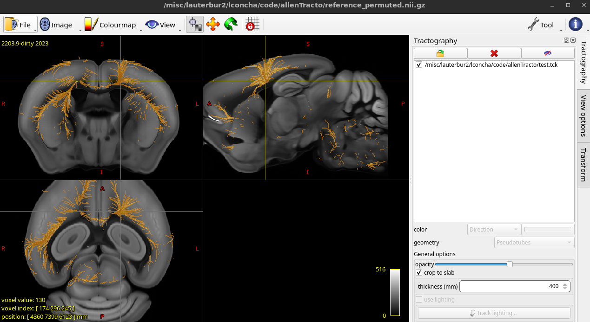

# allenTracto
Tools to perform virtual tractography of the Allen Mouse Brain Atlas



see https://hackmd.io/@lconcha/S1QPhHllY


The file `reference.tiff` was converted to Analyze format using Fiji. Then permuted via mrtrix to have the following orientation and dimensions:

```init
dim: 456,528,320
vox: 25,25,25
layout: +0,-2,+1
datatype: Float32LE
transform: 1, 0, 0, 1
transform: 0, 1, 0, 1
transform: 0, 0, 1, 1
```

The `json2tck.m` converter permutes and flips the axes of the streamlines to match the orientation of `reference_permuted.nii.gz`, so it can be properly visualized in mrview.


# Notes
* The template (`reference.tiff`) is downloaded automatically when using [brainrender](https://github.com/brainglobe/brainrender) and it is stored in `~/.brainglobe`. See above for how I converted it to NIFTI and permuted its axes to ease visualization in mrview.
* Streamlines of injection experiments are downloaded from the [streamline downloader](https://neuroinformatics.nl/HBP/allen-connectivity-viewer/streamline-downloader.html). You can input one or more experiment IDs separated by commas. Example: `180720175,127084296,100141780,288169135,166082842,584903636,126909424,100141273,277957908,512130198,298273313,606250170,272697944,297711339,156786234,298325807,100141563,597007858,168229113,179641666,166461193,179640955,182616478,287461719,177893658,159651060,310194040,591612976,157909001,477836675`.


